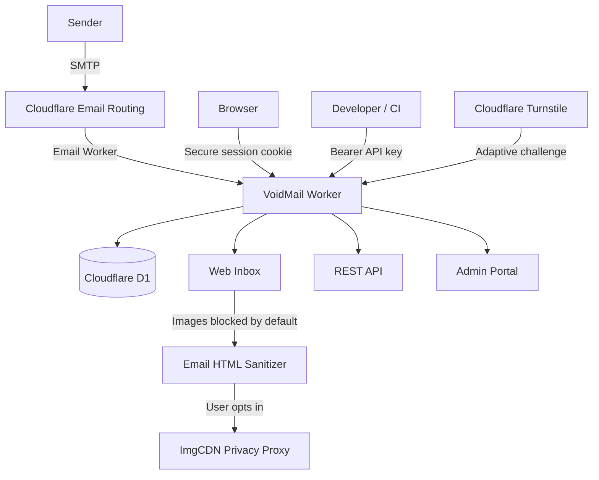

<div align="center">


<p>
  
  
  
  
  
</p>

<p>
  <a href="../../issues">
    
  </a>
  <a href="../../issues">
    
  </a>
</p>

</div>

<hr />

# 📮 VoidMail

> **A self-hosted temporary email service and developer API powered by Cloudflare Workers, Email Routing, and D1.**

VoidMail receives email through Cloudflare Email Routing, stores inboxes and messages in D1, and exposes them through a web interface and REST API. It is designed for developers who need disposable inboxes for application testing, automated workflows, signup verification, integration tests, or short-lived email access.

No application server to maintain. No client-controlled session identifiers. Just an edge-native inbox that disappears into the void. ✨

---

## 📑 Table of Contents

- [Features](#-features)
- [Architecture](#-architecture)
- [Security Model](#-security-model)
- [Prerequisites](#-prerequisites)
- [Installation](#-installation)
- [Configuration](#-configuration)
- [Database Migrations](#-database-migrations)
- [Email Routing](#-email-routing)
- [Deployment](#-deployment)
- [API Endpoints](#-api-endpoints)
- [API Usage](#-api-usage)
- [Admin Portal](#-admin-portal)
- [Local Development](#-local-development)
- [Verification](#-verification)
- [Project Structure](#-project-structure)
- [Troubleshooting](#-troubleshooting)
- [Security Reporting](#-security-reporting)
- [Documentation](#-documentation)
- [License](#-license)

---

## ✨ Features

- **📬 Temporary inboxes at the edge**
  - Creates randomized anime-themed temporary email addresses (e.g. `nezuko0x12@domain`).
  - Supports multiple email domains from one Worker deployment.
- **🧭 Session inbox switcher**
  - Keeps a list of inboxes created by the current browser session.
  - Switches between inboxes without exposing the session token to JavaScript.
- **🔌 Developer REST API**
  - Creates inboxes and reads messages using public sessions or API keys.
  - Includes interactive API documentation through bundled Swagger UI.
- **🛡️ Layered abuse protection**
  - Applies IP, session, domain, and global rate limits.
  - Supports adaptive Cloudflare Turnstile challenges.
- **🔒 Privacy-focused email rendering**
  - Sanitizes HTML email server-side.
  - Blocks external images by default and optionally loads them through ImgCDN.
- **🧰 Admin portal**
  - Manages inboxes, API keys, domains, public access, and quotas.
- **⚡ Cloudflare-native runtime**
  - Uses Workers, Email Routing, D1, Workers Assets, and Observability.

---

## 🏗 Architecture



| Component | Purpose |
| --- | --- |
| **Cloudflare Email Routing** | Sends incoming domain email to the Worker |
| **Hono Worker** | Serves the web UI, REST API, admin portal, and email handler |
| **Cloudflare D1** | Stores sessions, inboxes, messages, API keys, settings, and rate-limit buckets |
| **Workers Assets** | Serves pinned Lucide, Chart.js, and Swagger UI assets from the same origin |
| **Turnstile** | Challenges suspicious public inbox creation attempts |
| **ImgCDN** | Proxies external email images when the user explicitly opts in |

---

## 🔐 Security Model

VoidMail applies defense in depth instead of relying on one control:

- **Server-issued sessions** use `Secure`, `HttpOnly`, and `SameSite=Lax` cookies.
- **Exclusive inbox ownership** prevents one inbox from being claimed by multiple public sessions.
- **Rate limiting** combines IP, session, domain, global quota, and creation cooldowns.
- **Adaptive Turnstile** appears only after repeated inbox creation when configured.
- **CORS allowlist** permits credentialed browser access only from approved origins.
- **API cache protection** applies `no-store` to session, inbox, and message responses.
- **Browser hardening** includes HTTPS redirect, HSTS, CSP report-only, clickjacking protection, MIME sniffing protection, and restrictive browser policies.
- **Email HTML sanitization** removes active content, unsafe links, event handlers, forms, nested frames, and external resource loaders.
- **External images are blocked by default** to reduce sender tracking.
- **Vendor scripts are pinned and self-hosted** through Workers Assets.
- **Structured security logs** exclude authorization values, cookies, request bodies, and email content.

CSP currently runs in report-only mode because the frontend still uses inline scripts and Google Fonts. See [`docs/SECURITY_HEADERS.md`](docs/SECURITY_HEADERS.md) before enabling enforcement.

---

## ✅ Prerequisites

| Requirement | Details |
| --- | --- |
| **Node.js** | Node.js 18 or newer |
| **Cloudflare account** | Access to Workers, D1, Email Routing, and optionally Turnstile |
| **Cloudflare-managed domain** | Required for Email Routing and custom inbox domains |
| **Wrangler authentication** | Run `npx wrangler login` before provisioning resources |

---

## 📦 Installation

### 1. Clone and install

```bash
git clone https://github.com/ilhmlnaa/tempmail-worker.git
cd tempmail-worker
npm install
npx wrangler login
```

### 2. Create the D1 database

```bash
npx wrangler d1 create tempmail-db
```

Copy the generated `database_id` into `wrangler.toml`:

```toml
[[d1_databases]]
binding = "DB"
database_name = "tempmail-db"
database_id = "YOUR_DATABASE_ID"
```

### 3. Initialize a new database

For a fresh deployment with no existing schema:

```bash
npx wrangler d1 execute tempmail-db --remote --file=src/db/schema.sql
```

---

## ⚙️ Configuration

Public configuration is stored under `[vars]` in `wrangler.toml`:

```toml
[vars]
MAIL_DOMAINS = "mail.example.com,mail2.example.com"
ALLOWED_ORIGINS = "https://mail.example.com"
IMGCDN_BASE_URL = "https://imgcdn.example.com"
TURNSTILE_SITE_KEY = "0x4AAAA..."
SECURITY_CONTACT = "mailto:security@example.com"
SECURITY_POLICY_URL = "https://mail.example.com/security"
```

### Configuration Reference

| Variable | Required | Description |
| --- | --- | --- |
| `MAIL_DOMAINS` | Yes | Comma-separated domains accepted for temporary inboxes |
| `ALLOWED_ORIGINS` | Yes | Comma-separated browser origins allowed to use credentialed API requests |
| `IMGCDN_BASE_URL` | Recommended | Base URL used to proxy external email images |
| `TURNSTILE_SITE_KEY` | Optional | Public Cloudflare Turnstile widget key |
| `SECURITY_CONTACT` | Recommended | Monitored contact published through `/.well-known/security.txt` |
| `SECURITY_POLICY_URL` | Optional | Public vulnerability disclosure policy URL |

### Worker Secrets

Secrets must be stored through Wrangler, not committed under `[vars]`:

```bash
npx wrangler secret put TURNSTILE_SECRET_KEY
npx wrangler secret put AUTH_SECRET
```

| Secret | Required | Description |
| --- | --- | --- |
| `TURNSTILE_SECRET_KEY` | Only with Turnstile | Server-side key used to verify challenge tokens |
| `AUTH_SECRET` | Optional | Admin bootstrap secret; the `/setup` flow can be used instead |

Turnstile is enabled only when both `TURNSTILE_SITE_KEY` and `TURNSTILE_SECRET_KEY` are present.

---

## 🗃 Database Migrations

Use the schema file only for a new database. For an existing production database, apply migrations in order:

```bash
npx wrangler d1 execute tempmail-db --remote \
  --file=src/db/migrations/0001_unique_inbox_ownership.sql

npx wrangler d1 execute tempmail-db --remote \
  --file=src/db/migrations/0002_create_rate_limits.sql
```

> **Important:** Back up important production data and verify whether each migration has already been applied before running it. Do not repeatedly execute destructive schema migrations.

---

## ✉️ Email Routing

1. Open the Cloudflare Dashboard and select the inbox domain.
2. Go to **Email** → **Email Routing** and enable Email Routing.
3. Add a catch-all routing rule.
4. Select **Send to a Worker**.
5. Choose the deployed VoidMail Worker.
6. Confirm every domain is also listed in `MAIL_DOMAINS`.

Email Routing does not deliver inbound email to a local `wrangler dev` process. End-to-end reception must be tested against a deployed Worker.

---

## 🚀 Deployment

Run validation before deploying:

```bash
npx tsc --noEmit
npx tsx src/test.ts
npx wrangler deploy --dry-run
```

Deploy the Worker and bundled frontend assets:

```bash
npm run deploy
```

Recommended Cloudflare Dashboard settings:

1. Set **SSL/TLS mode** to `Full (strict)`.
2. Enable **Always Use HTTPS**.
3. Add a cache rule that bypasses cache for `/api/*`.
4. Keep Workers Observability enabled and review security events.
5. Do not enable HSTS preload until every relevant subdomain permanently supports HTTPS.

---

## 🌐 API Endpoints

| Method | Path | Authentication | Description |
| --- | --- | --- | --- |
| `GET` / `POST` | `/api/session` | Public cookie | Creates or refreshes a server-issued public session |
| `GET` | `/api/session/inboxes` | Public cookie | Lists inboxes owned by the current session |
| `POST` | `/api/inboxes` | Public cookie or API key | Creates an inbox |
| `GET` | `/api/inboxes/{address}/messages` | Owner session or API key | Lists sanitized messages for an inbox |
| `DELETE` | `/api/inboxes/{address}` | Owner session or API key | Removes or unlinks an inbox |
| `GET` | `/docs` | Public | Opens interactive API documentation |
| `GET` | `/.well-known/security.txt` | Public | Publishes the configured security contact |

Public browser sessions are stored in an `HttpOnly` cookie. JavaScript does not receive or manage the session token.

API clients should use a Bearer API key generated from the admin portal:

```http
Authorization: Bearer YOUR_API_KEY
```

---

## 🔌 API Usage

### Create an inbox with an API key

```bash
curl -X POST https://mail.example.com/api/inboxes \
  -H "Authorization: Bearer YOUR_API_KEY" \
  -H "Content-Type: application/json" \
  -d '{"domain":"mail.example.com","address":"integration-test"}'
```

Example response:

```json
{
  "address": "integration-test@mail.example.com"
}
```

### Read messages

```bash
curl https://mail.example.com/api/inboxes/integration-test%40mail.example.com/messages \
  -H "Authorization: Bearer YOUR_API_KEY"
```

To request external images through the configured privacy proxy:

```bash
curl "https://mail.example.com/api/inboxes/integration-test%40mail.example.com/messages?images=proxy" \
  -H "Authorization: Bearer YOUR_API_KEY"
```

External image loading remains opt-in. Do not treat an image proxy as a substitute for sender trust or content validation.

---

## 🧰 Admin Portal

Open the initial setup page after deployment:

```text
https://mail.example.com/setup
```

After creating the admin password, use:

| Page | Purpose |
| --- | --- |
| `/login` | Admin authentication |
| `/admin` | Dashboard and domain statistics |
| `/admin/inboxes` | Inbox management |
| `/admin/settings` | Domains, public access, and quota settings |
| `/admin/docs` | Authenticated API documentation |

The first setup password is stored through the application settings in D1. Use a strong password and restrict access to the admin portal through Cloudflare Access if the deployment is sensitive.

---

## 🛠 Local Development

Start the Worker locally:

```bash
npm run dev
```

Useful checks:

```bash
npx tsc --noEmit
npx tsx src/test.ts
npx wrangler deploy --dry-run
npm audit --omit=dev
```

Email Routing cannot forward real inbound mail to the local process. Use local development for UI, API, and database behavior, then deploy to verify inbound email delivery.

---

## 🧪 Verification

### Transport and API headers

```bash
curl -I http://mail.example.com/
curl -I https://mail.example.com/
```

### CORS preflight

```bash
curl -i -X OPTIONS https://mail.example.com/api/session \
  -H "Origin: https://mail.example.com" \
  -H "Access-Control-Request-Method: GET"
```

### Unsupported method and content type

```bash
curl -i -X PUT https://mail.example.com/api/session

curl -i -X POST https://mail.example.com/api/inboxes \
  -H "Content-Type: text/plain" \
  --data '{}'
```

Expected behavior:

- HTTP redirects to HTTPS.
- Official-origin preflight returns `204`.
- Unsupported methods return `405` with an `Allow` header.
- Non-JSON API POST requests return `415`.
- Sensitive API responses include `Cache-Control: no-store, private`.

---

## 📁 Project Structure

```text
tempmail-worker/
├── docs/                         # Security and deployment guides
├── public/vendor/                # Pinned same-origin frontend assets
├── src/
│   ├── api/                      # Authentication and REST routes
│   ├── db/                       # D1 schema, queries, and migrations
│   ├── email/                    # Email handler and HTML sanitizer
│   ├── security/                 # HTTP, rate limit, Turnstile, logging
│   ├── web/                      # Landing page, admin portal, API docs
│   ├── index.ts                  # Worker entry point
│   └── test.ts                   # Runnable security self-checks
├── package.json
├── tsconfig.json
└── wrangler.toml
```

---

## 🔧 Troubleshooting

### ❌ Inbox receives no email

- Confirm Email Routing is enabled for the domain.
- Confirm the catch-all route targets the correct Worker.
- Confirm the recipient domain is listed in `MAIL_DOMAINS`.
- Review Workers Observability logs for email handler errors.

### ❌ Browser API requests fail with CORS errors

- Add the exact frontend origin to `ALLOWED_ORIGINS`.
- Include the scheme (`https://`) and omit trailing paths.
- Deploy again after updating `wrangler.toml`.
- Never use `*` with cookie-based sessions.

### ❌ Turnstile never appears

- Confirm both the site key and secret key are configured.
- Confirm the production hostname is allowed in the Turnstile widget.
- Turnstile is adaptive and appears only after repeated inbox creation.

### ❌ D1 reports a missing table

Apply the schema for a fresh database or the required migration for an existing database. Do not mix both approaches blindly on production data.

### ❌ External images remain blocked

- Confirm `IMGCDN_BASE_URL` is reachable.
- Confirm the source URL uses HTTPS and does not resolve to a private network.
- Review [`docs/EMAIL_PRIVACY.md`](docs/EMAIL_PRIVACY.md) for ImgCDN-side requirements.

---

## 🚨 Security Reporting

Configure a monitored address before publishing the security contact:

```toml
SECURITY_CONTACT = "mailto:security@example.com"
SECURITY_POLICY_URL = "https://mail.example.com/security"
```

The Worker then serves:

```text
https://mail.example.com/.well-known/security.txt
```

Do not configure an unmonitored mailbox. Security reports may contain time-sensitive vulnerability information.

---

## 📚 Documentation

| Guide | Description |
| --- | --- |
| [`docs/TURNSTILE.md`](docs/TURNSTILE.md) | Adaptive Turnstile setup and verification |
| [`docs/SECURITY_HEADERS.md`](docs/SECURITY_HEADERS.md) | HTTPS, CORS, CSP, cache, and browser hardening |
| [`docs/EMAIL_PRIVACY.md`](docs/EMAIL_PRIVACY.md) | HTML sanitization and ImgCDN privacy controls |
| [`docs/SECURITY_REPORTING.md`](docs/SECURITY_REPORTING.md) | `security.txt` and safe operational logging |

---

## 📜 License

Licensed under the [MIT License](LICENSE).
